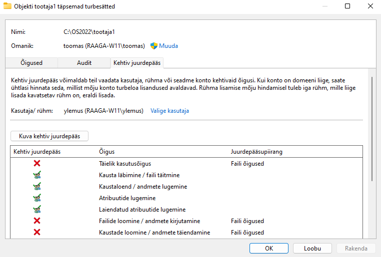
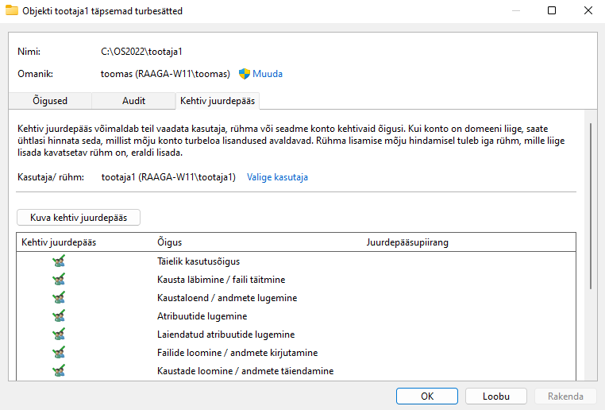

1. Võrrelge `Administrator` ja `SYSTEM` privileege ning kirjutage vähemalt üks tegevus mille jaoks on vaja `SYSTEM` õigusi.
   
   **Change the time zone**
   
   **Debug programs**
2. Ekraanivaade turvalise kausta seadetest (ainult üks kasutaja saab teha kõike ja Ülemus ainult lugeda)
   
   
   
   
3. Kirjuta praktikumi aruandesse vähemalt 3 soovitust (muudatust), mida Microsoft soovitab `Windowsi turve` seadete juures parandada, suurendamaks Windows operatsioonisüsteemi turvalisust.
   
   **Windows väidab, et mälu terviklus on välja lülitatud ning seade võib olla haavatav. Soovitab selle sisse lülitada.**
   
   **Soovitab sisse logida oma Microsofti kontoga.**
   
   **Soovitab häälestada OneDrive'i failitaastustesuvandid lunavararünnaku korral.**
4. Sobiv kasutajakonto kontrolli seadistus koos põhjendusega (Süsteem ja turve)
   
   **Valisin *Vaikesäte - teavita mind alati* , sest siis olen alati teadlik kui programmid üritavad installida tarkvara või teha arvutis muudatusi. Lisaks soovitab Windows ise ka seda.**
5. Kirjelda 3 `Local Security Policy` lisaseadistust turvalisuse tagamiseks, koos põhjendustega.
6. Minimaalselt 2 ekraanivaadet testimise käigus esinenud keeluteavitustest, koos selgitusega mida ning millise kasutajaga tehti.
7. Ekraanivaade Event Vieweri aknast, kus näha ebaõnnestunud sisselogimiskatsete logikirje
8. Tehke ekraanivaade `DisplayLastLogonInfo` registrivõtmest koos väärtusega `1`.